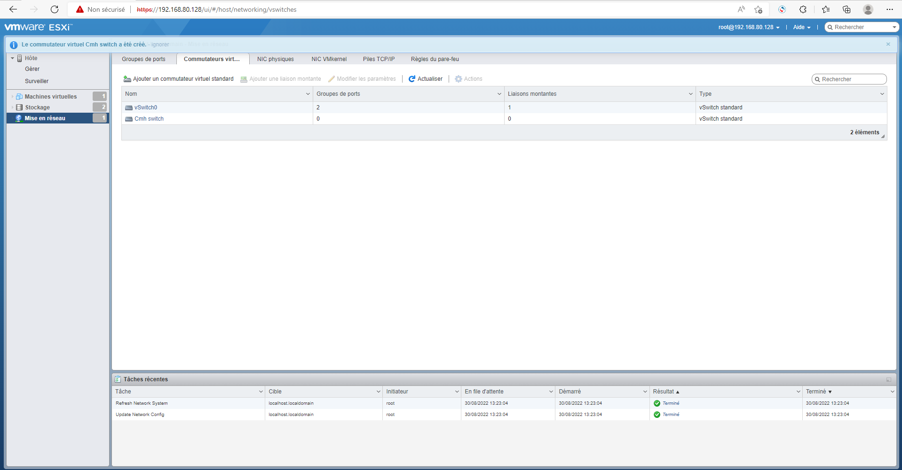

# Virtualization-based Cloud Solution

My principle project on **Cloud Marketing Hub Company** is about creating a virtual network by a virtualization-based cloud solution with the VMware product *vSphere(ESXI)*.


### 1.Overview about Vsphere technology


**vSphere :** 
vSphere is product from vmware aserver virtualization software application. It debuted in 2009 as the successor to the company’s flagship VMware Infrastructure solution and serves as a complete platform for implementing and managing virtual machine (VM) infrastructure on a large scale. Sometimes referred to as a cloud operating system or virtualized data center platform, VMware vSphere is designed to enable IT departments to run application workloads on their most efficient or cost-effective compute resources.Vsphere include other technologies like vcenter , esxi ..

**ESXI :** 
A VMware vSphere Hypervisor is a virtualized server that manages an IT infrastructure and allows one to run one or more virtual machines on a computer. It offers built-in VM management, advanced memory resourcing, efficient storage allocation, and driver hardening and you can create a virtual network with virtual switch.


**Difference between VMware Workstation and vShpere :**
|VMware Workstation	| VMware Vsphere | 
|:--------------|:-------------------|
|Vmware workstation is a software which allows you to run multiple operating systems on a single PC. You can have multiple virtual machines wherein each of them can have independant operating systems.|Vmware Vsphere is a server virtualization platform for virtual data centers. There are these ESX servers known as 'bare metal hypervisors'. They are installed over your physical server and partitions it into multiple virtual machines. ESX Servers are managed by the VMware Infrastructure Client. Its centralized management platform is called VCenter.|
|installed on a operating system | installed directly in hardware |


### 2. My Project :
**1.Installation ESXI:**
- To download ESXI for free watch This [video](https://youtu.be/eLTPZauxqzU) on my channel
- To install ESXI hypervisor on VMware watch this [video](https://www.youtube.com/watch?v=YTYYsrrbS9M&list=PLGm6YTcAxLLB6XyoZbVquokVd4XwO2MaH&index=2)

**2.Setup in in dell poweredge r930 server :**


The Dell EMC PowerEdge R930 rack server was specifically designed for the most demanding
enterprise applications and features industry-leading internal storage and memory scalability to
optimize application performance.

PowerEdge R930 Configuration :
 - Latest Intel Xeon E7-8800 v4 and E7-4800 v4 processors
 - Up to 96 DIMMS DDR4 memory
 - Supports up to 8 Express Flash NVMe PCIe SSDs
 - Up to 10 PCIe 3.0 slots
 
 Install steps :
 - create a bootable USB flash drive to use to deploy ESXI Hypervisor .
 - start the server and press "*f12*" key
 - booted from the flash drive 
 - same steps of installtion in Vmware workstation watch the  [video](https://www.youtube.com/watch?v=YTYYsrrbS9M&list=PLGm6YTcAxLLB6XyoZbVquokVd4XwO2MaH&index=2)

 - fix ip address (same network)
 - Access from a browser of other computer
 - watch this [video](https://youtube.com/shorts/x431Mbqpd7c?feature=share)
 

 

 **3.Create a new user with roles:**

 Create a user give you a centralized workshop to manage the esxi with many administrator and give them all roles that you want.
  
 Watch this [video](https://youtu.be/jmWdwiqDOJQ) to see how to create users

**4.Create a virtual machine(windows server) :**

A``` virtual machine``` can be defined as a software implementation of a computer that runs an operating system and executes programs just like a physical computer. Virtual machines contain their own virtual hardware, including a virtual CPU, memory, hard disk, and network interface card, which look like physical hardware to the operating systems and applications.

``` Windows Server 2016 ```, Microsoft’s newest server operating system, has the potential to be a big hit with businesses, IT professionals, and users. Developed alongside Windows 10, the Windows Server team worked closely with the System Center and Azure teams to establish a tightly-knit ecosystem. The end result delivers a seamless Microsoft experience from beginning to end; it bridges familiar technologies such as Active Directory and virtualization with modern infrastructure concepts, like containerization, federated services, and cloud-based services.

In my project i chose windows server to manage my virtual domain with active directory , dns and dhcp .

  **- import the iso image** : to crete a new machine in esxi hypervisor you must upload the iso image  .

  **- Create a new virtuel machine** : now you must create anew machine using the iso image imported .

   Watch this [video](https://www.youtube.com/watch?v=Oyil0KMr_1k) to see how to create windows server machine

**5.Create windows client machines :**

in order to create a network for users of your company you must create some client machines for using in work tasks like word and browsing .
in my project i chose windows 8 like a client machine because it is simple to use and easy to manage with windows server.
To create a client machine you follow same steps to create windows server just you imported your iso image that you need 

**6.Create a virtual switch :**

  ```Virtual switches :``` work very much like their physical counterparts, Ethernet switches, but lack some of their advanced functionality. They are used to establish a connection between the virtual and the physical network. A virtual switch can detect which virtual machines are logically connected to each of its virtual ports and use that information to forward traffic to the correct virtual machines. A virtual switch is connected to physical switches by using physical Ethernet adapters to join virtual networks with physical networks.

  Two connection types are possible on a virtual switch in vSphere:

1. virtual machine port groups : ports used to connect virtual machines to other VMs or the physical network.

2. VNkernel ports : ports configured with their own IP address, subnet mask and default gateway to allow hypervisor management traffic, vMotion, iSCSI storage access, network attached storage (NAS) access, and vSphere Fault Tolerance (FT) logging.



virtual port : 


### Tools using in my work : ### 
 * dell server powere edge R930
 * D.Link switch
 * dell computers

### Contact information :
- [Facebook](https://www.facebook.com/profile.php?id=100082569926842)
- [Twitter](https://twitter.com/HamzaAchahboun3)
- [LinkedIn](https://www.linkedin.com/in/achahboune-hamza/)
- [Redit](https://www.reddit.com/user/HamzaVerde)
- [Youtube](https://www.youtube.com/channel/UCVIOkzY9OijnUJ-daoZsXqw)

 ### Helpful Tutorial in my youtube Channel
  -[VSphere](https://www.youtube.com/watch?v=eLTPZauxqzU&list=PLGm6YTcAxLLB6XyoZbVquokVd4XwO2MaH)
